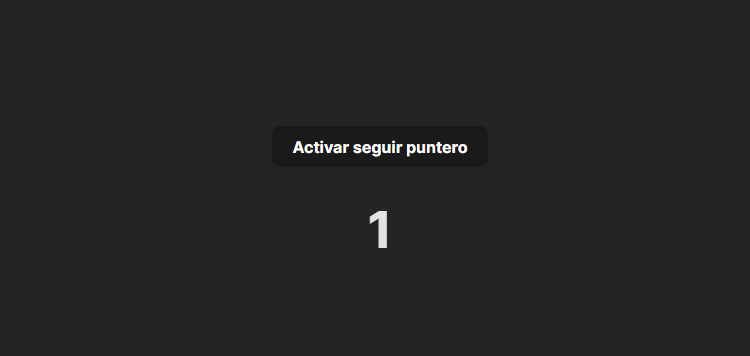
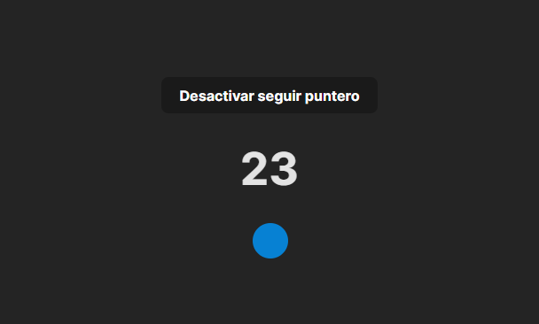

# Diseño de un punto gráfico con React

Este proyecto es una aplicación que te permite darle un seguimiento al puntero cuando pulsas un botón. Se desarrollo con el fin de aprender el uso de los useState de React.

## Contenidos

- [Requisitos](#requisitos)
- [Instalación](#instalación)
- [Despliegue Local](#despliegue-local)
- [Capturas de Pantalla](#capturas-de-pantalla)

## Requisitos

Para ejecutar este proyecto, necesitas tener instalado:

- Node.js (versión 18 o superior)
- npm (versión 9 o superior) o yarn (opcional)

## Instalación

1. Clona el repositorio en tu máquina local:

    ```bash
    git clone https://github.com/pauldev24/Mouse-Follower.git
    cd Mouse-Follower
    ```

2. Instala las dependencias del proyecto:

    Con npm:
    ```bash
    npm install
    ```

    Con yarn:
    ```bash
    yarn install
    ```

## Despliegue Local

Para ejecutar el proyecto en tu entorno local, utiliza el siguiente comando:

Con npm:
```bash
npm run dev
```

## Capturas de Pantalla

